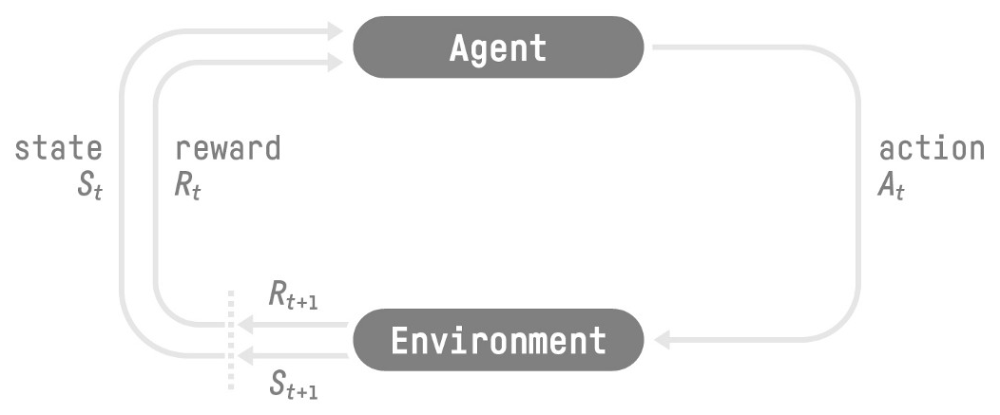
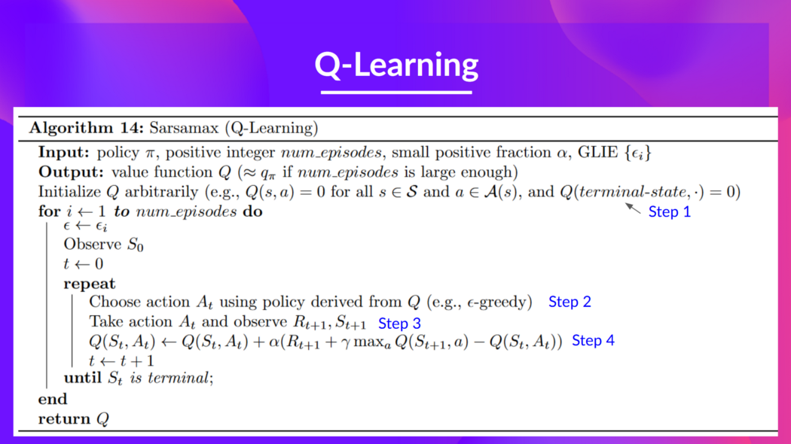

# Hugging Face Deep RL Course notes

## Syllabus
-   [Unit 1: Introduction to Deep Reinforcement Learning](#unit-1-introduction-to-deep-reinforcement-learning)
-   [Unit 2: Q-Learning](#unit-2-q-learning)
-   [Unit 3: Deep Q-Learning with Atari Games](#unit-3-deep-q-learning-with-atari-games)
-   [Bonus Unit: Automatic Hyperparameter Tuning using Optuna](#bonus-unit-automatic-hyperparameter-tuning-using-optuna)

## Unit 1: Introduction to Deep Reinforcement Learning

The idea behind Reinforcement Learning is that an agent (an AI) will learn from the environment by interacting with it (through trial and error) and receiving rewards (negative or positive) as feedback for performing actions.

Learning from interactions with the environment comes from our natural experiences.



A simple RL process would consist of an agent that:
* receives a **state** $S_0$ from the **Environment**
* based on that **state** $S_0$, the agent takes **action** $A_0$
* **Environment** goes to a **new state** $S_1$
* the **Environment** gives some **reward** $R_1$ to the agent

This RL loop outputs a sequence ($S_0$, $A_0$, $R_1$, $S_1$)

The agent’s goal is to maximize its cumulative reward, called **the expected return**.

**Reward hypothesis:** all goals can be described as the maximization of the expected return.

**Markov property:** the agent agent needs only the current state to decide what action to take and not the history of all the states and actions they took before.

**Observations/States:**
  * **State:** a complete description of the state of the world (there is no hidden information). In a fully observed environment like a chess board.

  * **Observation:** a partial description of the state. In a partially observed environment like a Super Mario Bros world.

**Action Space:** set of all possible actions in an environment
  * **Discrete space:** the number of possible actions is finite like in a Super Mario Bros game.
  * **Continuous space:** the number of possible actions is infinite like the number of possible actions for a self driving car.

**Reward:** the only feedback for the agent, thanks to it the agent knows if the action taken was good or not. ($\tau$, read Tau, is a trajectory, meaning a sequence of states and actions)
  * Expected cumulative reward: $\displaystyle R(\tau) = r_{t+1} + r_{t+2} + r_{t+3} + ... = \sum_{k=0}^{\infty} r_{t+k+1}$
  * Discounted expected cumulative reward: $\displaystyle R(\tau) = r_{t+1} + \gamma r_{t+2} + \gamma^2 r_{t+3} + ... = \sum_{k=0}^{\infty} \gamma^k r_{t+k+1}$. Used when we care more about the rewards that come sooner because they're more likely to happen. The discount rate $\gamma$ is most of the time between 0.95 and 0.99.

**Types of tasks:**
  * **Episodic tasks:** we have a starting point and an ending point (a terminal state). This creates an episode: a list of States, Actions, Rewards, and new States (like in a Super Mario level).
  * **Continuing tasks:** tasks that continue forever with no terminal state (automated stock trading for example).

**Exploration/Exploitation trade-off:**
  * **Exploration** is exploring the environment by trying random actions in order to find more information about the environment.
  * **Exploitation** is exploiting known information to maximize the reward.

The **Policy** $\pi$ is the brain of an RL agent, it takes a state an input and gives an action as output.
 * **Deterministic policy:** $\pi(s) = a$ a policy that given a state will always return the same action.
 * **Stochastic policy:** $\pi(a|s) = P(A|s)$ outputs a probability distribution over actions.

**Policy based methods vs Value based methods:**
  * **Policy based methods:** we learn a policy function directly.
  * **Value based methods:** instead of training a policy function, we train a value function that maps a state to the expected value of being at that state, and we construct a policy from this value function.

## Unit 2: Q-Learning

**Value functions:**
  * **State-value function for policy $\pi$ :** 
  
    $\displaystyle V_{\pi}(s) = E_{\pi}(G_t|S_t = s) = E_{\pi}(\sum_{k=0}^{\infty} \gamma^k r_{t+k+1}|S_t = s)$. 
  
    This is the expected return if the agent starts at state $s$ and then follows the policy forever after. In other words the value of the state $s$ under the policy $\pi$.

  * **Action-value function for policy $\pi$ :** 
  
    $\displaystyle Q_{\pi}(s, a) = E_{\pi}(G_t|S_t = s, A_t = a) = E_{\pi}(\sum_{k=0}^{\infty} \gamma^k r_{t+k+1}|S_t = s, A_t = a)$. 
  
    This is the expected return if the agent starts at state $s$, takes the action $a$ and then follows the policy forever after. In other words the value of the pair $(s, a)$ under the policy $\pi$.

**Bellman Equations of value function:**
Each of the value functions satisfy a particular recursive relationship called the **Bellman Equation**.

  * **Bellman Equation of the state-value function :** 
  
    $V_{\pi}(s) = E_{\pi}(R_{t+1} + \gamma V_{\pi}(S_{t+1}) | S_t = s)$. 

  * **Bellman Equation of the action-value function :** 
  
    $Q_{\pi}(s, a) = E_{\pi}(R_{t+1} + \gamma Q_{\pi}(S_t, A_{t+1})|S_t = s, A_t = a)$. 

**Monte Carlo vs TD Learning:**

  * **Monte Carlo:** we update the value function from **a complete episode**, and so we use the actual accurate discounted return of this episode.
  
    $V_{\pi}(S_{t}) \leftarrow V_{\pi}(S_{t}) + \alpha [G_{t} - V(S_{t})]$. 

  * **TD Learning:** we update the value function from **a step**, so we replace $G_{t}$​ that we don’t have with an estimated return called TD target.

    $V_{\pi}(S_{t}) \leftarrow V_{\pi}(S_{t}) + \alpha [R_{t+1} + \gamma V(S_{t+1}) - V(S_{t})]$. 

**Link between Value and Policy:** $\pi_{}^{*}(s) = argmax_{a} Q_{}^{*}(s, a)$

#### **Code**

Remember we have two policies since Q-Learning is an **off-policy** algorithm. This means we're using a **different policy for acting and updating the value function**.

- Epsilon-greedy policy (acting policy)
- Greedy-policy (updating policy)

Greedy policy will also be the final policy we'll have when the Q-learning agent will be trained. The greedy policy is used to select an action from the Q-table.




```python
# Training parameters
n_training_episodes = 10000  # Total training episodes
learning_rate = 0.7          # Learning rate

# Evaluation parameters
n_eval_episodes = 100        # Total number of test episodes

# Environment parameters
env_id = "FrozenLake-v1"     # Name of the environment
max_steps = 99               # Max steps per episode
gamma = 0.95                 # Discounting rate
eval_seed = []               # The evaluation seed of the environment

# Exploration parameters
max_epsilon = 1.0            # Exploration probability at start
min_epsilon = 0.05           # Minimum exploration probability 
decay_rate = 0.0005          # Exponential decay rate for exploration prob
```

```python
def initialize_Q_table(env):
  num_possible_states = env.observation_space.n
  num_possible_action = env.action_space.n
  
  Qtable = np.zeros((num_possible_states, num_possible_action))
  return Qtable
```

```python
def greedy_policy(Qtable, state):
  # Exploitation: take the action with the highest state, action value
  action = np.argmax(Qtable[state][:])
  
  return action


def epsilon_greedy_policy(Qtable, state, epsilon):
  # Randomly generate a number between 0 and 1
  random_int = random.uniform(0, 1)

  if random_int > epsilon: # exploitation
    action = np.argmax(Qtable[state][:])
  elif random_int <= epsilon: # exploration
    action = env.action_space.sample()
  
  return action
```

```python
def train(n_training_episodes, min_epsilon, max_epsilon, decay_rate, env, max_steps, Qtable):
  """
  For episode in the total of training episodes:

  Reduce epsilon (since we need less and less exploration)
  Reset the environment

    For step in max timesteps:    
      Choose the action At using epsilon greedy policy
      Take the action (a) and observe the outcome state(s') and reward (r)
      Update the Q-value using Bellman equation Q(s,a) + lr [R(s,a) + gamma * max Q(s',a') - Q(s,a)]
      If done, finish the episode
      Our next state is the new state
  """

  for episode in tqdm(range(n_training_episodes)):

    # Reduce epsilon (because we need less and less exploration)
    epsilon = min_epsilon + (max_epsilon - min_epsilon)*np.exp(-decay_rate*episode)

    state = env.reset()
    step = 0
    done = False

    for step in range(max_steps):

      action = epsilon_greedy_policy(Qtable, state, epsilon)

      new_state, reward, done, info = env.step(action)

      # Update Q(s,a):= Q(s,a) + lr [R(s,a) + gamma * max Q(s',a') - Q(s,a)]
      # NB: Qtable[new_state][greedy_policy(Qtable, new_state)] = np.max(Qtable[new_state])
      Qtable[state][action] += learning_rate * (reward + gamma * Qtable[new_state][greedy_policy(Qtable, new_state)] - Qtable[state][action])   

      if done:
        break
      
      # Our next state is the new state
      state = new_state

  return Qtable
```

```python
env = gym.make('FrozenLake-v1', map_name="4x4", is_slippery=False)
Qtable = initialize_Q_table(env)
Qtable = train(n_training_episodes, min_epsilon, max_epsilon, decay_rate, env, max_steps, Qtable)
```
## Unit 3: Deep Q-Learning with Atari Games

## Bonus Unit: Automatic Hyperparameter Tuning using Optuna
